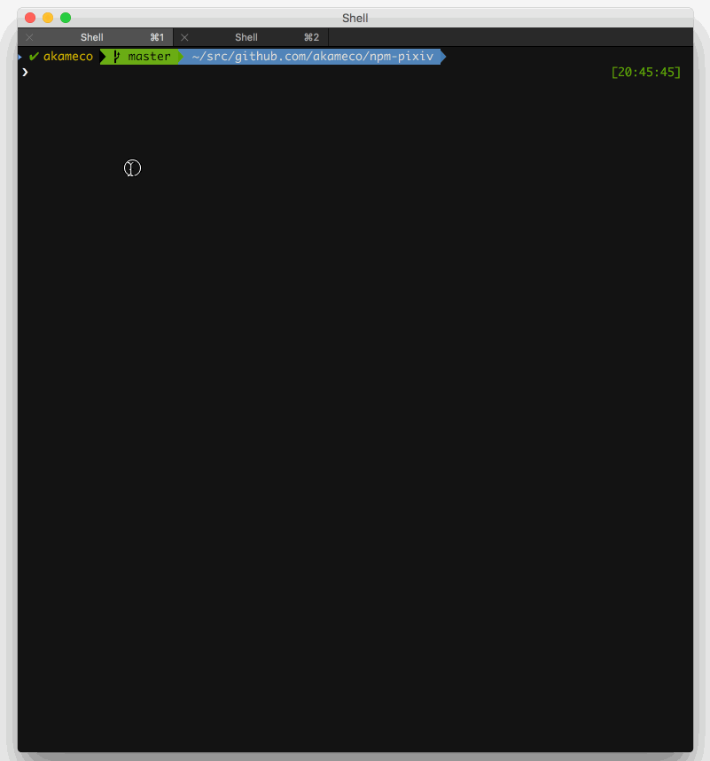

# npm-pixiv [](https://travis-ci.org/akameco/npm-pixiv)

> watch pixiv daily ranking while running npm install

**Note**: Images are only displayed inline for [users of iTerm2 using version 2.9 or greater](https://www.iterm2.com/images.html).

## DEMO



## Installation

```
$ npm install --global npm-pixiv 
```

## Usage

```
$ npm-pixiv install -S react react-dom
```

## Recommend

Add this to ~/.bashrc or ~/.zshrc:

```
alias npm=npm-pixiv
```


## License

MIT
